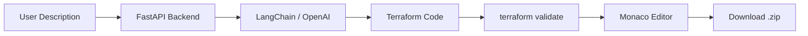

# AI-Powered Terraform Code Generator

A web application that converts plain English infrastructure descriptions into production-ready Terraform code. Describe what you need in natural language and get validated, security-hardened Terraform configurations instantly.

## Architecture



## Features

- **Natural Language to Terraform** -- Describe your infrastructure in plain English and receive complete Terraform configurations
- **Multi-Cloud Support** -- Generate code for AWS, GCP, and Azure providers
- **Security Best Practices** -- Enforced encryption at rest, least-privilege IAM, private networking, and audit logging in every generated configuration
- **Terraform Validation** -- Generated code is automatically validated using `terraform validate` before delivery
- **Monaco Editor** -- Full-featured code editor with HCL syntax highlighting, search, and inline editing
- **Zip Download** -- Download all generated files as a structured `.zip` archive ready for `terraform init`
- **Generation History** -- Browse and revisit previously generated configurations

## Tech Stack

| Layer       | Technology           | Purpose                            |
|-------------|----------------------|------------------------------------|
| LLM         | OpenAI GPT-4o        | Natural language understanding     |
| Orchestration | LangChain          | Prompt management and chaining     |
| Backend     | FastAPI              | REST API and validation pipeline   |
| Frontend    | React + TypeScript   | Single-page application            |
| Editor      | Monaco Editor        | In-browser code editing            |
| IaC         | Terraform            | Code validation and formatting     |

## Quick Start

### Prerequisites

- Docker and Docker Compose
- An OpenAI API key

### 1. Clone and configure

```bash
git clone https://github.com/your-org/terraform-generator.git
cd terraform-generator
cp .env.example .env
# Edit .env and add your OPENAI_API_KEY
```

### 2. Start with Docker Compose

```bash
docker compose up --build
```

The application will be available at:

| Service  | URL                     |
|----------|-------------------------|
| Frontend | http://localhost:3000    |
| Backend  | http://localhost:8000    |
| API Docs | http://localhost:8000/docs |

### 3. Start without Docker (development)

**Backend:**

```bash
cd backend
python -m venv .venv
source .venv/bin/activate   # Windows: .venv\Scripts\activate
pip install -r requirements.txt
uvicorn app.main:app --reload --port 8000
```

**Frontend:**

```bash
cd frontend
npm install
npm run dev
```

## Example Prompts

Try these descriptions to generate Terraform code:

> "Create a VPC on AWS with 3 public subnets, 3 private subnets, a NAT gateway, and flow logs enabled"

> "Set up a GKE cluster on GCP with a dedicated node pool of 3 e2-standard-4 machines, workload identity, and network policy enabled"

> "Deploy a static website on Azure using Blob Storage with a CDN endpoint, custom domain, and HTTPS enforced"

> "Create an S3 bucket with versioning, server-side encryption using KMS, replication to a second region, and a lifecycle policy that moves objects to Glacier after 90 days"

> "Set up a serverless API on AWS with API Gateway, Lambda functions in Python, DynamoDB table, and CloudWatch alarms"

## Project Structure

```
terraform-generator/
├── backend/
│   ├── app/
│   │   ├── api/             # Route handlers
│   │   ├── core/            # Configuration and settings
│   │   ├── models/          # Pydantic schemas
│   │   └── services/        # LangChain + Terraform logic
│   ├── tests/
│   ├── Dockerfile
│   └── requirements.txt
├── frontend/
│   ├── src/
│   │   ├── components/      # React components
│   │   ├── hooks/           # Custom React hooks
│   │   ├── pages/           # Page-level components
│   │   └── services/        # API client
│   ├── Dockerfile
│   └── package.json
├── terraform/
│   ├── modules/
│   │   ├── apis/            # GCP API enablement
│   │   ├── iam/             # Service accounts and bindings
│   │   ├── secret-manager/  # Secret storage for API keys
│   │   └── cloud-run/       # Cloud Run service deployment
│   ├── main.tf
│   ├── variables.tf
│   ├── outputs.tf
│   └── terraform.tfvars.example
├── .github/
│   └── workflows/
│       └── ci.yml           # Lint, test, validate, build
├── docker-compose.yml
├── .env.example
├── .gitignore
└── README.md
```

## Deployment

### Railway

Both services are configured for Railway deployment:

1. Connect your GitHub repository to Railway
2. Create two services: `backend` and `frontend`
3. Set the root directory for each service to `backend/` and `frontend/`
4. Add environment variables from `.env.example` to each service
5. Set the `VITE_API_URL` on the frontend to the backend's Railway URL

### GCP Cloud Run (via Terraform)

```bash
cd terraform
cp terraform.tfvars.example terraform.tfvars
# Edit terraform.tfvars with your values

terraform init
terraform plan
terraform apply
```

## API Endpoints

| Method | Endpoint              | Description                        |
|--------|-----------------------|------------------------------------|
| POST   | `/api/generate`       | Generate Terraform from description|
| GET    | `/api/history`        | List generation history            |
| GET    | `/api/history/{id}`   | Get a specific generation          |
| GET    | `/api/download/{id}`  | Download generated files as zip    |
| GET    | `/health`             | Health check                       |

## License

MIT
