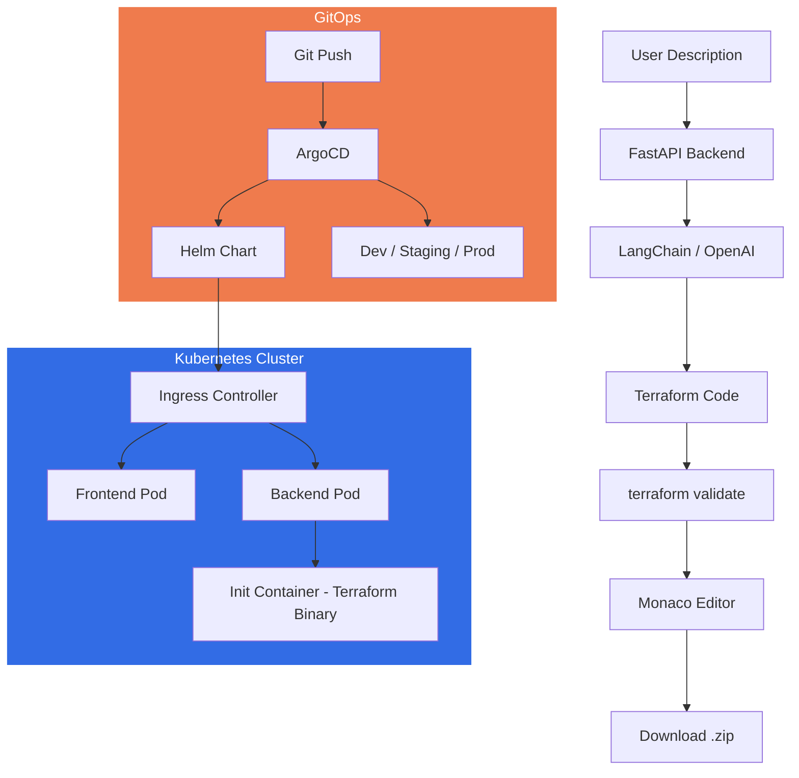

# AI-Powered Terraform Code Generator

A web application that converts plain English infrastructure descriptions into production-ready Terraform code. Describe what you need in natural language and get validated, security-hardened Terraform configurations instantly.

## Architecture



## Features

- **Natural Language to Terraform** -- Describe your infrastructure in plain English and receive complete Terraform configurations
- **Multi-Cloud Support** -- Generate code for AWS, GCP, and Azure providers
- **Security Best Practices** -- Enforced encryption at rest, least-privilege IAM, private networking, and audit logging in every generated configuration
- **Terraform Validation** -- Generated code is automatically validated using `terraform validate` before delivery
- **Monaco Editor** -- Full-featured code editor with HCL syntax highlighting, search, and inline editing
- **Zip Download** -- Download all generated files as a structured `.zip` archive ready for `terraform init`
- **Generation History** -- Browse and revisit previously generated configurations
- **Kubernetes-Native Deployment** -- Production-grade manifests with init containers, HPA, PDBs, network policies, and topology spread constraints
- **Helm Chart** -- Fully parameterised Helm chart with per-environment value overrides
- **ArgoCD GitOps** -- Multi-environment continuous delivery with automated sync for dev/staging and manual approval for production

## Tech Stack

| Layer         | Technology           | Purpose                                  |
|---------------|----------------------|------------------------------------------|
| LLM           | OpenAI GPT-4o        | Natural language understanding           |
| Orchestration | LangChain            | Prompt management and chaining           |
| Backend       | FastAPI              | REST API and validation pipeline         |
| Frontend      | React + TypeScript   | Single-page application                  |
| Editor        | Monaco Editor        | In-browser code editing                  |
| IaC           | Terraform            | Code validation and formatting           |
| Container     | Kubernetes           | Workload orchestration and scheduling    |
| Packaging     | Helm                 | Templated Kubernetes manifests           |
| GitOps        | ArgoCD               | Declarative continuous delivery          |

## Quick Start

### Prerequisites

- Docker and Docker Compose
- An OpenAI API key

### 1. Clone and configure

```bash
git clone https://github.com/your-org/terraform-generator.git
cd terraform-generator
cp .env.example .env
# Edit .env and add your OPENAI_API_KEY
```

### 2. Start with Docker Compose

```bash
docker compose up --build
```

The application will be available at:

| Service  | URL                     |
|----------|-------------------------|
| Frontend | http://localhost:3000    |
| Backend  | http://localhost:8000    |
| API Docs | http://localhost:8000/docs |

### 3. Start without Docker (development)

**Backend:**

```bash
cd backend
python -m venv .venv
source .venv/bin/activate   # Windows: .venv\Scripts\activate
pip install -r requirements.txt
uvicorn app.main:app --reload --port 8000
```

**Frontend:**

```bash
cd frontend
npm install
npm run dev
```

## Kubernetes Deployment

The `k8s/` directory contains raw Kubernetes manifests that can be applied directly with `kubectl`. These are useful as a reference or for clusters where Helm is not available.

Key highlights:

- **Terraform init container** -- The backend Deployment uses an Alpine-based init container that downloads and installs the Terraform binary (`v1.9.8`) into a shared `emptyDir` volume. The main application container mounts this volume read-only at `/shared/terraform`, keeping the application image small and the Terraform version easy to change.
- **Security hardening** -- Pods run as non-root (`uid 1000`), use a read-only root filesystem, drop all Linux capabilities, and disallow privilege escalation.
- **Health probes** -- Readiness, liveness, and startup probes ensure zero-downtime rolling updates.
- **Horizontal Pod Autoscaler** -- CPU-based autoscaling (2-10 replicas at 70 % target) for the backend.
- **Network policies** -- Only the ingress controller namespace can reach the pods; backend-to-frontend traffic is denied.
- **Topology spread constraints** -- Pods are spread across nodes to survive single-node failures.

```bash
kubectl apply -f k8s/namespace.yaml
kubectl apply -f k8s/
```

## Helm Chart

The `helm/terraform-generator/` chart wraps all Kubernetes resources into a single, parameterised release.

### Install

```bash
helm install terraform-generator ./helm/terraform-generator \
  --namespace terraform-generator \
  --create-namespace \
  -f helm/terraform-generator/values.yaml
```

### Override values per environment

```bash
# Development
helm upgrade --install terraform-generator ./helm/terraform-generator \
  -n terraform-generator-dev --create-namespace \
  -f helm/terraform-generator/values.yaml \
  -f argocd/overlays/dev/values.yaml

# Production
helm upgrade --install terraform-generator ./helm/terraform-generator \
  -n terraform-generator-prod --create-namespace \
  -f helm/terraform-generator/values.yaml \
  -f argocd/overlays/prod/values.yaml
```

### Configurable parameters (excerpt)

| Parameter                            | Default              | Description                              |
|--------------------------------------|----------------------|------------------------------------------|
| `backend.replicaCount`               | `2`                  | Number of backend pods                   |
| `backend.image.tag`                  | `latest`             | Backend container image tag              |
| `backend.terraform.version`          | `1.9.8`              | Terraform version for the init container |
| `backend.autoscaling.enabled`        | `true`               | Enable HPA for the backend               |
| `backend.podDisruptionBudget.enabled`| `true`               | Enable PDB for the backend               |
| `frontend.replicaCount`              | `2`                  | Number of frontend pods                  |
| `ingress.className`                  | `nginx`              | Ingress controller class                 |
| `networkPolicy.enabled`              | `true`               | Deploy network policies                  |
| `serviceAccount.create`              | `true`               | Create a dedicated ServiceAccount        |

See `helm/terraform-generator/values.yaml` for the full list.

## ArgoCD GitOps

The `argocd/` directory provides a complete GitOps setup for multi-environment delivery.

### Resources

| File                        | Purpose                                                     |
|-----------------------------|-------------------------------------------------------------|
| `project.yaml`             | ArgoCD `AppProject` scoping allowed repos, namespaces, and RBAC roles |
| `application.yaml`         | Standalone `Application` for single-cluster deployment       |
| `applicationset.yaml`      | `ApplicationSet` generating one Application per environment  |
| `overlays/dev/values.yaml` | Helm value overrides for **dev** (1 replica, DEBUG logging, relaxed limits) |
| `overlays/staging/values.yaml` | Helm value overrides for **staging**                     |
| `overlays/prod/values.yaml`| Helm value overrides for **prod** (3+ replicas, HPA, rate limiting, External Secrets) |

### Multi-environment strategy

The `ApplicationSet` maps Git branches to environments:

| Environment | Branch     | Namespace                    | Auto-sync | Prune |
|-------------|------------|------------------------------|-----------|-------|
| dev         | `develop`  | `terraform-generator-dev`    | Yes       | Yes   |
| staging     | `staging`  | `terraform-generator-staging`| Yes       | Yes   |
| prod        | `main`     | `terraform-generator-prod`   | No        | No    |

Production requires a manual sync in the ArgoCD UI or CLI to prevent unreviewed changes from rolling out automatically.

### Bootstrap

```bash
# 1. Create the AppProject
kubectl apply -f argocd/project.yaml

# 2. Deploy all environments via the ApplicationSet
kubectl apply -f argocd/applicationset.yaml

# Or deploy a single environment with the standalone Application
kubectl apply -f argocd/application.yaml
```

## Example Prompts

Try these descriptions to generate Terraform code:

> "Create a VPC on AWS with 3 public subnets, 3 private subnets, a NAT gateway, and flow logs enabled"

> "Set up a GKE cluster on GCP with a dedicated node pool of 3 e2-standard-4 machines, workload identity, and network policy enabled"

> "Deploy a static website on Azure using Blob Storage with a CDN endpoint, custom domain, and HTTPS enforced"

> "Create an S3 bucket with versioning, server-side encryption using KMS, replication to a second region, and a lifecycle policy that moves objects to Glacier after 90 days"

> "Set up a serverless API on AWS with API Gateway, Lambda functions in Python, DynamoDB table, and CloudWatch alarms"

## Project Structure

```
terraform-generator/
├── backend/
│   ├── app/
│   │   ├── api/                 # Route handlers
│   │   ├── core/                # Configuration and settings
│   │   ├── models/              # Pydantic schemas
│   │   └── services/            # LangChain + Terraform logic
│   ├── tests/
│   ├── Dockerfile
│   └── requirements.txt
├── frontend/
│   ├── src/
│   │   ├── components/          # React components
│   │   ├── hooks/               # Custom React hooks
│   │   ├── pages/               # Page-level components
│   │   └── services/            # API client
│   ├── Dockerfile
│   └── package.json
├── terraform/
│   ├── modules/
│   │   ├── apis/                # GCP API enablement
│   │   ├── iam/                 # Service accounts and bindings
│   │   ├── secret-manager/      # Secret storage for API keys
│   │   └── cloud-run/           # Cloud Run service deployment
│   ├── main.tf
│   ├── variables.tf
│   ├── outputs.tf
│   └── terraform.tfvars.example
├── k8s/
│   ├── backend/
│   │   ├── configmap.yaml       # Backend environment variables
│   │   ├── deployment.yaml      # Deployment with Terraform init container
│   │   ├── hpa.yaml             # Horizontal Pod Autoscaler
│   │   ├── secret.yaml          # API key secret
│   │   └── service.yaml         # ClusterIP service
│   ├── frontend/
│   │   ├── deployment.yaml      # Frontend Deployment
│   │   └── service.yaml         # ClusterIP service
│   ├── ingress.yaml             # Nginx Ingress with TLS
│   ├── namespace.yaml           # Dedicated namespace
│   └── network-policy.yaml      # Ingress-only network policy
├── helm/
│   └── terraform-generator/
│       ├── Chart.yaml           # Chart metadata (v0.1.0)
│       ├── values.yaml          # Default values
│       └── templates/
│           ├── _helpers.tpl
│           ├── NOTES.txt
│           ├── backend-configmap.yaml
│           ├── backend-deployment.yaml
│           ├── backend-hpa.yaml
│           ├── backend-pdb.yaml
│           ├── backend-secret.yaml
│           ├── backend-service.yaml
│           ├── frontend-deployment.yaml
│           ├── frontend-service.yaml
│           ├── ingress.yaml
│           ├── network-policy.yaml
│           └── serviceaccount.yaml
├── argocd/
│   ├── project.yaml             # AppProject with RBAC roles
│   ├── application.yaml         # Standalone Application
│   ├── applicationset.yaml      # Multi-env ApplicationSet
│   └── overlays/
│       ├── dev/values.yaml      # Dev overrides
│       ├── staging/values.yaml  # Staging overrides
│       └── prod/values.yaml     # Prod overrides
├── .github/
│   └── workflows/
│       └── ci.yml               # Lint, test, validate, build
├── docker-compose.yml
├── .env.example
├── .gitignore
└── README.md
```

## Deployment

### Railway

Both services are configured for Railway deployment:

1. Connect your GitHub repository to Railway
2. Create two services: `backend` and `frontend`
3. Set the root directory for each service to `backend/` and `frontend/`
4. Add environment variables from `.env.example` to each service
5. Set the `VITE_API_URL` on the frontend to the backend's Railway URL

### GCP Cloud Run (via Terraform)

```bash
cd terraform
cp terraform.tfvars.example terraform.tfvars
# Edit terraform.tfvars with your values

terraform init
terraform plan
terraform apply
```

### Kubernetes + ArgoCD (recommended for production)

```bash
# Apply the ArgoCD project and ApplicationSet
kubectl apply -f argocd/project.yaml
kubectl apply -f argocd/applicationset.yaml

# ArgoCD will automatically deploy dev and staging from their branches.
# Production requires a manual sync after merging to main.
```

## API Endpoints

| Method | Endpoint              | Description                        |
|--------|-----------------------|------------------------------------|
| POST   | `/api/generate`       | Generate Terraform from description|
| GET    | `/api/history`        | List generation history            |
| GET    | `/api/history/{id}`   | Get a specific generation          |
| GET    | `/api/download/{id}`  | Download generated files as zip    |
| GET    | `/health`             | Health check                       |

## License

MIT
